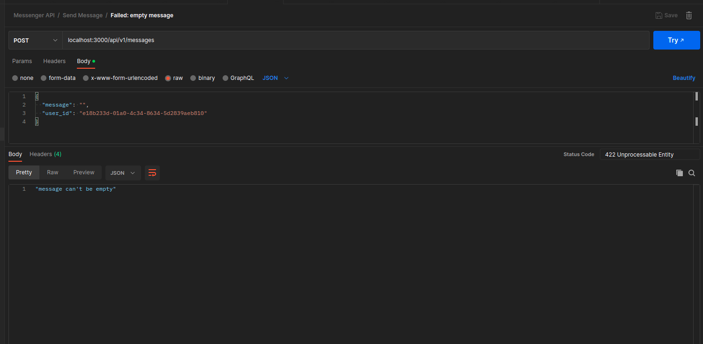
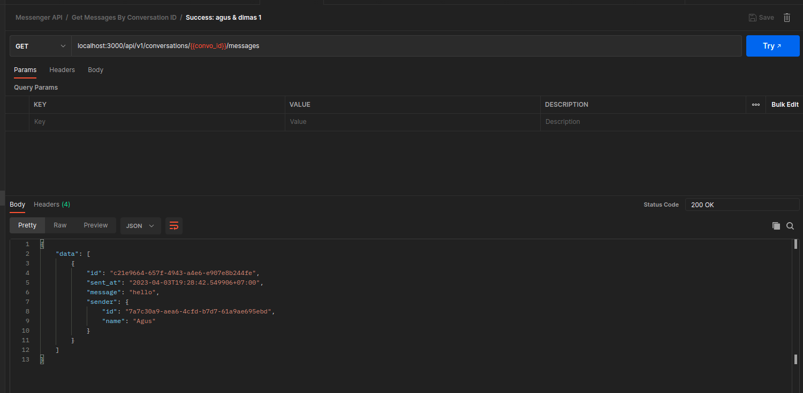

# Messenger API

## Screenshots
#### Send image success

#### Send image failed, invalid message

#### Get messages by conversation id success 1

#### Get messages by conversation id success 2

#### Get messages by conversation id failed (forbidden)

#### Get messages by conversation id failed (not found)

#### Get conversations by user success (empty)

#### Get conversations by user success (filled)

#### Get conversation by ID success

#### Get conversation by ID failed (forbidden)

#### Get conversation by ID failed (not found)


### How to init go.mod?

This project is initiated by using command:

```sh
go mod init gitlab.com/raihanlh/messenger-api
```

### How to change between golang version?

Use gvm to change between golang version
Can be installed from [gvm github page](https://github.com/moovweb/gvm)

### How to download packages?

```sh
go mod tidy
```

### How to migrate database?

Install UUID extension on psql

```sql
CREATE EXTENSION IF NOT EXISTS "uuid-ossp";
```

Run migration

```sh
go run cmd/migration/migration.go
```

### How to run seeder?

To run all seeder

```sh
go run cmd/seeder/seeder.go
```

To run specific seeder

```sh
go run cmd/seeder/seeder.go UserSeed
go run cmd/seeder/seeder.go UserSeed TestSeed
```

### Generate test coverage

```
go test -v -coverprofile cover.out ./YOUR_CODE_FOLDER/...
go tool cover -html cover.out -o cover.html
open cover.html
```

## Testing

Go has a built-in testing package for both [unit](https://pkg.go.dev/testing#T) and [benchmark](https://pkg.go.dev/testing#B) tests. While unit test is necessary, benchmark test is more of a nice-to-have and is only useful for logic-heavy codes (i.e. usecases, helper functions, etc). Learn more about golang's unit test practices [here](https://www.digitalocean.com/community/tutorials/how-to-write-unit-tests-in-go-using-go-test-and-the-testing-package).

### Generate mock

When testing, it's recommended to use an auto-generated mocks so you don't have to manually mock a function everytime you create new one. We're generally using [mockgen](https://pkg.go.dev/github.com/golang/mock/mockgen) but feel free to use other tool you're most comfortable using.

- Install mockgen on your computer (not on this project)

```bash
go install github.com/golang/mock/mockgen@v1.6.0
```

- Generate mock

```bash
mockgen -source={GOPATH}/example-service/example-folder/example_file.go -destination={GOPATH}/example-service/testing/mocks/example-folder/example_file.go
```

Example:

```bash
mockgen -source=internal/domain/user/user.go -destination=testing/mocks/user/user.go
```

## Documentation

API Documentation can be accessed through `{SERVER_URL}/swagger/index.html` route.

- Add [API Operation](https://github.com/swaggo/swag#api-operation) on new handler function
- Install swaggo on your machine (not on this project)

```bash
go install github.com/swaggo/swag/cmd/swag@latest
```

- Generate docs

```bash
swag init -g cmd/server/main.go --output api/docs
```
